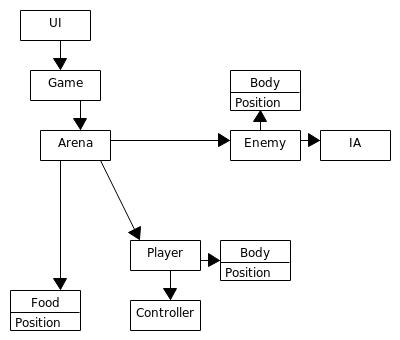

Architecture
==================

Format: 
We used an [Component based Architecture](https://en.wikipedia.org/wiki/Component-based_software_engineering), every data and funtion inside each class is related. Each component is modular and we look foward to achieve good cohesion.
